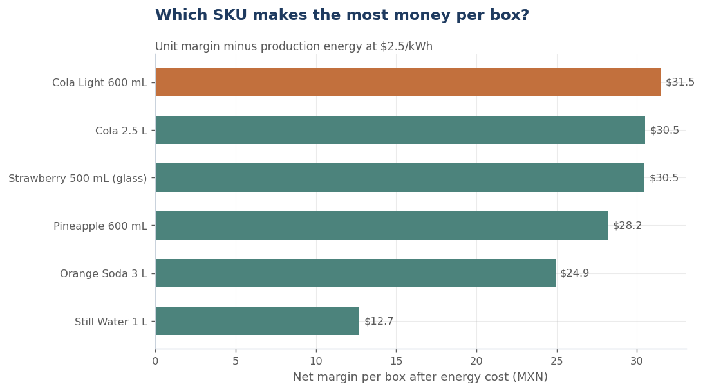

# ⚡ SKU Energy & Profitability Analysis — Bottling Plant

**Statistical inference on production energy consumption per SKU**: confidence intervals, Welch's t-tests, and ANOVA + Tukey HSD on compressor sensor data — then netting energy cost out of each product's margin to find **which SKU makes the most money per box**.


> **Context.** Built during an ITESM statistical-methods challenge with **Coca-Cola FEMSA (KOF)**, the world's largest Coca-Cola bottler (team project). The original work analyzed real plant sensor data — energy drawn by refrigeration compressors per bottling line and SKU. This repository reproduces the methodology with **synthetic data**; SKU names are generic and **no client data is included**.



## The question

Refrigeration compressors are among the biggest energy consumers in a bottling plant, and how much they draw depends on **what is being bottled**. Two questions follow:

1. **Engineering** — which compressors actually differ in consumption, and does the SKU change the picture? (statistically, not by eyeballing boxplots)
2. **Commercial** — once production energy is paid for, **which SKU is the most profitable per box?**

## The approach

| Step | Technique |
|---|---|
| Energy distributions per compressor & SKU | Boxplots, Q–Q normality checks |
| Mean energy estimation | 95% confidence intervals (t-based) |
| Compressor A vs. B | Welch's t-test, two- and one-tailed |
| All compressors / all SKUs at once | One-way ANOVA + Tukey HSD (controls family-wise error) |
| Profitability | kWh per box × industrial tariff, netted from unit margin |

## Key findings (synthetic run)

- The SKU being bottled **significantly changes** compressor energy draw (all 15 pairwise SKU differences significant under Tukey HSD).
- Visual impressions can mislead: one compressor pair that "looked different" was confirmed (p ≈ 10⁻³¹), another was statistically indistinguishable (p ≈ 0.99) — exactly why formal tests matter.
- **Ranking by net margin after energy cost changes the commercial picture**: the most energy-efficient carbonated SKU tops the ranking, while energy-hungry formats give part of their margin back to the power bill.

## Quick start

```bash
git clone https://github.com/Rodrigo-Trejo-Hdz/sku-energy-analysis.git
cd sku-energy-analysis
pip install -r requirements.txt
jupyter lab sku_energy_analysis.ipynb
```

The notebook is fully self-contained: it generates its own synthetic dataset (seeded) and runs end-to-end in seconds.

## Tech stack

**Python** · **SciPy** / **statsmodels** (inference: CIs, Welch's t, ANOVA, Tukey HSD) · **Pandas** / **NumPy** · **Matplotlib** · **Jupyter**

## Author

**Rodrigo Trejo** — Data Scientist & Analytics Engineer
[Portfolio](https://rodrigo-trejo-hdz.github.io/) · [LinkedIn](https://www.linkedin.com/in/rodrigo-trejo-hdz/)

## License

[MIT](LICENSE)